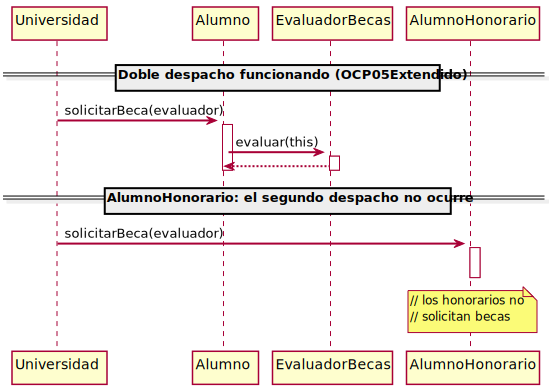

# LSP04 - El contrato roto en un sistema real

[OCP07](../../OCP/OCP07/README.md) muestra qué ocurre cuando se añade `AlumnoHonorario` a un sistema con doble despacho. Visto desde el eje OCP, el problema es de extensibilidad. Visto desde LSP, el problema es de contrato.

## El contrato de `Alumno`

```java
public void solicitarBeca(EvaluadorBecas evaluador) {
    evaluador.evaluar(this);
}
```

- Pre: `evaluador != null`
- Post: `evaluador.evaluar(this)` ha sido invocado

Cada subtipo de `Alumno` cumple este contrato. Es lo que hace posible el doble despacho: `Universidad` delega sin conocer el tipo concreto, confiando en que el segundo salto ocurrirá.

Mapeado al cuadrante:

| | Pre abierta o igual | Pre cerrada |
|---|---|---|
| **Post cerrada o igual** | Premium, Promocion | - |
| **Post abierta** | Deudores / **AlumnoHonorario** | Mayorista |

## La violación visible

Un desarrollador lanza una excepción:

```java
@Override
public void solicitarBeca(EvaluadorBecas evaluador) {
    throw new UnsupportedOperationException("Los alumnos honorarios no solicitan becas");
}
```

El sistema explota. Alguien añade una guardia en `Universidad`:

```java
if (!(alumno instanceof AlumnoHonorario)) {
    alumno.solicitarBeca(evaluador);
}
```

`Universidad` se acopla a una clase concreta. El smell es visible.

## La violación invisible

Otro desarrollador no hace nada:

```java
@Override
public void solicitarBeca(EvaluadorBecas evaluador) {
    // los alumnos honorarios no solicitan becas
}
```

`Universidad` queda limpia. No hay excepción, no hay `instanceof`, no hay señal de que algo falle.



## ¿Cómo te darías cuenta?

Por cada alumno que entra en `procesarSolicitudBeca`, el contrato garantiza que `evaluar` será invocado exactamente una vez. Con `AlumnoHonorario`, esa invocación no ocurre.

Si alguien contara cuántos alumnos procesó `Universidad` y cuántas veces fue llamado el evaluador, los números no cuadrarían. Sin esa instrumentación explícita - contadores en ambos extremos, comparación - el sistema no avisa. El fallo no deja huella.

Esta es la diferencia estructural con [LSP03](../LSP03/README.md): el Auditor detecta valores incorrectos comparando el resultado con el contrato. Aquí no hay resultado que comparar: el efecto requerido simplemente no ocurre.

## La condición necesaria del doble despacho

El doble despacho funciona porque cada nodo de la jerarquía garantiza que entregará el control al segundo participante. Un eslabón que no cumple ese contrato no rompe el mecanismo con ruido: lo cortocircuita en silencio.

**LSP es la condición necesaria del doble despacho.**

## *#2Think*

- ¿Qué instrumentación concreta añadirías para detectar que los números no cuadran? ¿Dónde la pondrías?
- ¿Es preferible una violación visible a una invisible? ¿Desde el punto de vista de quién?
- ¿Se puede detectar esta violación sin ejecutar el código?

## ¿Como se corrige?

El problema no es que `AlumnoHonorario` no solicite becas. El problema es que viola el contrato heredado para expresar esa restriccion.

-> [OCP08](../../OCP/OCP08/README.md)

<br><br><br><br><br><br><br><br><br><br><br><br><br><br><br><br><br><br><br><br><br><br><br><br><br>
