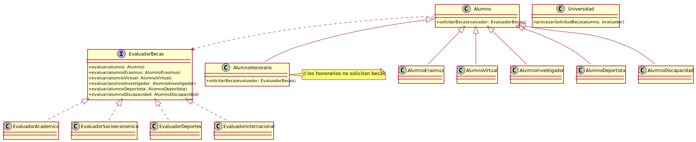

# OCP07 - Requisitos++

OCP05Extendido funciona con elegancia: cinco tipos de alumno, cuatro evaluadores, cero `instanceof`. El doble despacho hace su trabajo en silencio.

Llega un nuevo requisito.

## Un requisito

La universidad quiere incorporar alumnos honorarios - académicos visitantes, asistentes no matriculados en el sentido tradicional. Necesitan estar en el sistema, pero no son elegibles para becas.

Un desarrollador razona con toda la lógica del mundo:

```java
class AlumnoHonorario extends Alumno {
    @Override
    public void solicitarBeca(EvaluadorBecas evaluador) {
        // los alumnos honorarios no solicitan becas
    }
}
```

Compila. No explota. El sistema sigue funcionando para todos los demás alumnos. Se despliega.

## El sistema

`Universidad` queda limpia:

```java
public class Universidad {
    public void procesarSolicitudBeca(Alumno alumno, EvaluadorBecas evaluador) {
        alumno.solicitarBeca(evaluador);
    }
}
```

No hay `instanceof`. No hay excepción. No hay ninguna señal de que algo esté mal.

<div align=center>



</div>

Los alumnos honorarios simplemente no son evaluados. El segundo despacho nunca ocurre para ellos. El evaluador nunca sabe que existieron.

Ya vimos este patrón antes: [herencia por limitación](../../../../temario/01-diseño/02-relacionesClases.md#relaciones-por-transmisi%C3%B3n). Y ya sabíamos que no era deseable.

## La fractura

El contrato de `solicitarBeca` establece que `evaluador.evaluar(this)` será invocado. Cada subtipo de `Alumno` lo cumple - es exactamente lo que hace posible el doble despacho.

`AlumnoHonorario` lo viola. De dos formas posibles.

### Invisible

No hacer nada. El sistema no explota. `Universidad` queda limpia. Nadie avisa.


### Visible

Lanzar una excepción:

```java
@Override
public void solicitarBeca(EvaluadorBecas evaluador) {
    throw new UnsupportedOperationException("Los alumnos honorarios no solicitan becas");
}
```

El sistema explota en la primera ejecución. Alguien bajo presión añade una guardia en `Universidad`:

```java
public void procesarSolicitudBeca(Alumno alumno, EvaluadorBecas evaluador) {
    if (!(alumno instanceof AlumnoHonorario)) {
        alumno.solicitarBeca(evaluador);
    }
}
```

`Universidad` - que dependía únicamente de la abstracción `Alumno` - ahora se acopla a una clase concreta.

Diagnóstico idéntico, síntoma diferente: la variante visible avisa; la invisible no.

## El nombre del problema

El contrato de [OCP06](../OCP06/README.md) establece que `evaluar` será invocado exactamente una vez por alumno. `AlumnoHonorario` viola esa postcondición. No la debilita: la suprime.

Esto tiene nombre: **Principio de Sustitución de Liskov**. Un subtipo es válido si y solo si puede sustituir a su base sin alterar el comportamiento observable del sistema. `AlumnoHonorario` no puede: el sistema espera que `evaluar` ocurra, y no ocurre.

La evidencia práctica: si contaras cuántos alumnos entran en `procesarSolicitudBeca` y cuántas veces el evaluador es invocado, los números no cuadrarían. Sin esa instrumentación, nadie lo sabe.

-> [Principio de Sustitución de Liskov](../../../../temario/03-diseñoOO/LSP.md) — desarrollo formal

Hay tres salidas posibles:

|Sacar `AlumnoHonorario` de la jerarquía|Renegociar el contrato de la base|Camino C - Composición|
|-|-|-|
|No extiende `Alumno`. Clase independiente que `Universidad` gestiona por separado. Si realmente no comparte el contrato, quizá no debería estar en la jerarquía. Pero implica duplicar toda la lógica de "estar en el sistema".|`solicitarBeca()` en `Alumno` pasa a ser un no-op por defecto. `AlumnoHonorario` hereda sin sobreescribir. Pero el contrato queda debilitado para todos: el evaluador ya no puede asumir que será llamado.|La capacidad de solicitar beca se extrae como pieza componible. `Alumno` la delega. `AlumnoHonorario` recibe una implementación nula: no hace nada, no viola el contrato. El sistema de OCP05Extendido queda intacto.|

> Sigue en [OCP08](../OCP08/README.md)

<br><br><br><br><br><br><br><br><br><br><br><br><br><br><br><br><br><br><br><br><br><br><br><br><br>
